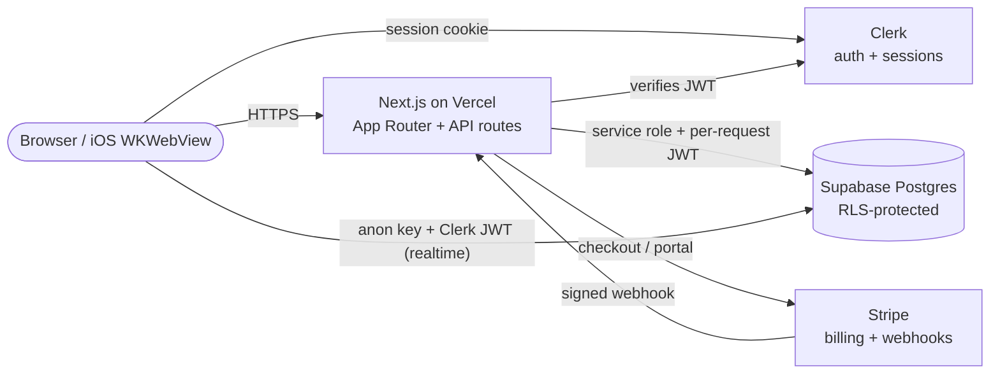

# ClubIt

ClubIt is a multi-tenant school-club management platform: every school is its
own tenant with admins, advisors, and students; clubs run rosters, attendance,
chat, events, polls, and elections inside the school boundary. The stack is
Next.js 16 (App Router) on Vercel, Supabase Postgres for data with row-level
security, Clerk for authentication, and Stripe for school subscriptions.
This codebase is under active security remediation following an external
review — see [`docs/security/ClubIt-Security-Assessment.md`](docs/security/ClubIt-Security-Assessment.md)
for the assessment that drives the current work plan.

## Architecture



Notes:

- The browser holds a Clerk session cookie and a short-lived Supabase JWT
  signed by Clerk; both reach Supabase for realtime subscriptions.
- Server-side, API routes call Supabase as the service role for writes and
  for cross-tenant administrative reads. RLS is the second authorization
  layer — see `docs/security/W2.1-RLS-PLAN.md`.

## Local development

Prerequisites:

- Node.js 20 or newer (Codemagic and Vercel both pin Node 20).
- A Supabase project (cloud or local CLI).
- A Clerk dev tenant with publishable + secret keys.
- A Stripe test-mode account with a webhook endpoint and signing secret.

Setup:

```bash
npm install                             # also installs Husky pre-commit hook
cp .env.example .env.local              # then fill in real dev-tier secrets
supabase start                          # if running Postgres locally
psql "$DATABASE_URL" -f supabase/schema.sql   # bootstrap the schema
# apply migrations in order — see "Migrations" below
npm run dev                             # http://localhost:3000
```

`.env.local` is gitignored. Never paste a real secret into a doc, a test
fixture, or an issue. The pre-commit hook blocks committed lines that look
like a real Clerk/Stripe/Supabase key — see
[`docs/security/SECRETS_POLICY.md`](docs/security/SECRETS_POLICY.md).

## Tests

| Command | What it runs |
|---|---|
| `npm test` | Vitest unit + security regression tests (`tests/`). |
| `npm run test:rls` | RLS-only suite against a real Postgres (`vitest.rls.config.ts`); needs `DATABASE_URL` pointing at a disposable Supabase. |
| `npm run test:e2e` | Playwright end-to-end tests. Requires a running dev server and Clerk test users. |

## Migrations

`supabase/schema.sql` is the historical bootstrap for a fresh environment.
All schema changes since W1 are tracked as numbered, reversible migrations
under `supabase/migrations/`:

| File | Purpose |
|---|---|
| `0001_users_rls_lockdown.sql` | Restricts `users` insert/update so a client can't self-promote (assessment finding C-5). |
| `0002_club_membership_rls.sql` | Replaces school-wide `club_in_scope` with per-club membership predicates (C-4). |
| `0003_pending_school_onboarding.sql` | Adds the pending-approval state for self-service school registrations (C-3). |
| `0004_secret_ballot.sql` | Removes voter identity from poll/election RLS projections (H-3). |

Apply migrations either via the Supabase SQL editor (paste each `.sql` file
in order) or with the Supabase CLI:

```bash
supabase db push                        # applies pending migrations
```

Each migration ships with a corresponding `.down.sql` for rollback. Migrations
are idempotent — they can be replayed safely.

## Data flow — student joins a club

```mermaid
sequenceDiagram
    autonumber
    participant U as Student (browser)
    participant C as Clerk
    participant N as Next.js API
    participant S as Supabase (RLS)

    U->>C: Sign in (email/password or OAuth)
    C-->>U: Session cookie + short-lived JWT
    U->>N: POST /api/school/clubs/:id (action: request_join)
    N->>C: auth() — verify session, get userId
    C-->>N: { userId }
    N->>S: select role,school_id from users where id = userId
    S-->>N: { role: 'student', school_id }
    N->>S: insert into join_requests (service role, school+club checked in code)
    S-->>N: ok
    N-->>U: 200 { pending: true }
    Note over U,S: Realtime: U also opens a supabase-js channel<br/>using anon key + Clerk JWT;<br/>RLS gates which membership rows U sees.
```

## Subprocessors

| Vendor | Role | Notes |
|---|---|---|
| Vercel | App hosting, edge network, function runtime | Serves all HTTP traffic. |
| Supabase | Postgres database, realtime, storage | Holds all education-record data. |
| Clerk | Authentication, session management, user profile | Source of truth for identity. |
| Stripe | Subscription billing, hosted checkout, webhooks | Per-school plan + customer records. |
| Codemagic | iOS CI / TestFlight uploads (`codemagic.yaml`) | Builds the Capacitor iOS shell. |

The full list with data categories and DPA links is in
[`docs/security/SUBPROCESSORS.md`](docs/security/SUBPROCESSORS.md).

## Security

- **Assessment (current state of remediation):** [`docs/security/ClubIt-Security-Assessment.md`](docs/security/ClubIt-Security-Assessment.md)
- **Secrets policy:** [`docs/security/SECRETS_POLICY.md`](docs/security/SECRETS_POLICY.md)
- **Residual dependency findings:** [`docs/security/DEPENDENCY_RESIDUALS.md`](docs/security/DEPENDENCY_RESIDUALS.md)
- **Threat model, IR, deletion policy, FERPA template, HECVAT:** see other files in `docs/security/`.

To report a vulnerability, email **security@clubit.app**.
<!-- TODO: confirm security@clubit.app is provisioned and monitored before publishing externally. -->
We aim to acknowledge new reports within one business day.
